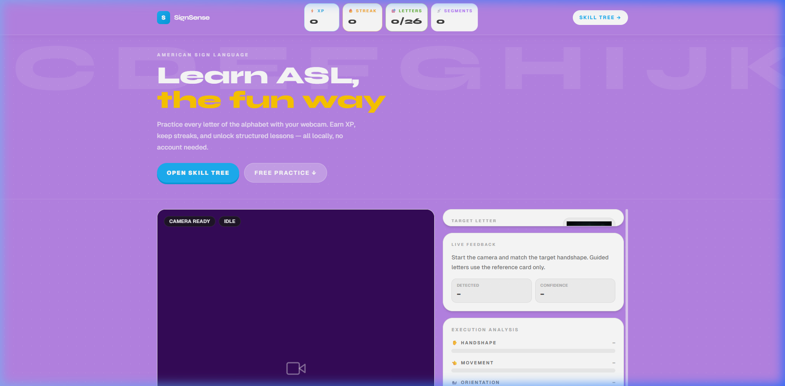
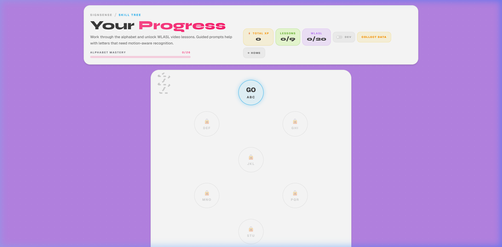
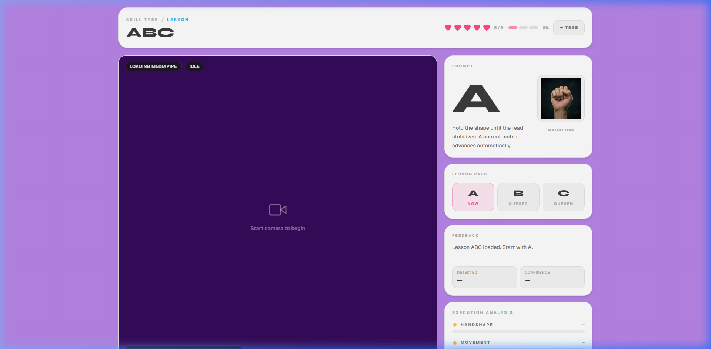
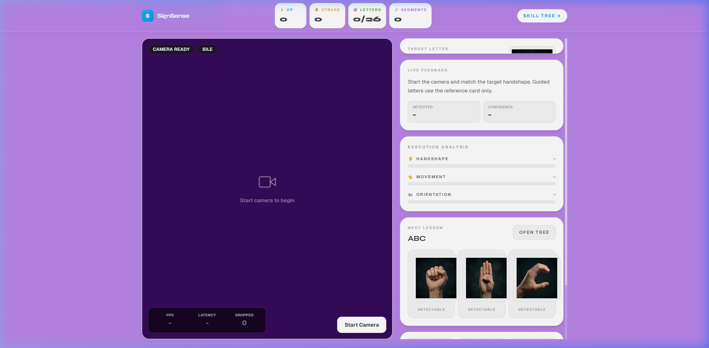

# SignSense: Interactive Sign Language Learning Platform

[](https://nextjs.org/)
[](https://fastapi.tiangolo.com/)
[](https://www.python.org/)
[](https://mediapipe.dev/)
[](https://pytorch.org/)

**SignSense** is a gamified, real-time Sign Language learning platform that leverages AI and computer vision to help users master ASL (American Sign Language). By providing instant feedback on handshapes, orientation, and movement, SignSense makes learning sign language intuitive, engaging, and effective.

---

## 🌟 Key Features

-   **🎯 Real-time Recognition**: Instant feedback on your signs using MediaPipe-powered landmark detection.
-   **📈 Gamified Learning Path**: Progress through a skill tree (Alphabet Mastery, WLASL concepts) and earn XP and streaks.
-   **🔍 Detailed Execution Analysis**: Feedback broken down by **Handshape**, **Movement**, and **Orientation**.
-   **🕹️ Free Practice Mode**: Jump straight into practicing any sign with live confidence scoring.
-   **📊 Progress Tracking**: Monitor your mastery across letters and vocabulary segments.

---

## 📸 Screenshots

### 🏠 Landing Page

*Welcome to SignSense - start your journey with a quick practice session or track your recent stats.*

### 🗺️ Learning Path (Skill Tree)

*Unlock new lessons as you progress through the Alphabet and WLASL curriculum.*

### 📚 Interactive Lessons

*Master individual letters with real-time feedback and execution analysis.*

### ⚡ Practice Mode

*Hone your skills with focused practice on specific target letters.*

---

## 🛠️ Tech Stack

### Frontend
- **Framework**: [Next.js 14](https://nextjs.org/) (App Router)
- **Styling**: [Tailwind CSS](https://tailwindcss.com/)
- **State Management**: [Zustand](https://github.com/pmndrs/zustand)
- **Animations**: [Framer Motion](https://www.framer.com/motion/)
- **Computer Vision**: [@mediapipe/tasks-vision](https://developers.google.com/mediapipe/solutions/vision)

### Backend
- **Framework**: [FastAPI](https://fastapi.tiangolo.com/)
- **ML Engine**: [PyTorch](https://pytorch.org/) & [NumPy](https://numpy.org/)
- **Database**: [PostgreSQL](https://www.postgresql.org/) with [SQLAlchemy](https://www.sqlalchemy.org/) & [Alembic](https://alembic.sqlalchemy.org/)
- **Task Queue**: [Celery](https://docs.celeryq.dev/) (for long-running ML tasks)

---

## 🧠 Backend ML Architecture

SignSense uses a multi-model pipeline to cover both static fingerspelling and dynamic word-level signing.

### 1. Fingerspelling MLP (Static Letters A–Z)

A lightweight two-layer MLP for real-time per-frame letter classification.

| Property | Value |
|---|---|
| Architecture | Linear(63→128, ReLU) → Linear(128→26) |
| Input | 21 MediaPipe hand landmarks × 3 (x, y, z) = 63 floats |
| Output | 26-class softmax (A–Z) |
| Inference latency | < 1 ms per frame (GPU) |
| Weights | `models/fingerspelling.pt` |

The model is based on the [`sid220/asl-now-fingerspelling`](https://huggingface.co/sid220/asl-now-fingerspelling) architecture and runs entirely on raw landmark coordinates — no image data needed.

---

### 2. Pose-TGCN (Temporal Graph Convolutional Network)

A graph-based sequence model for dynamic sign classification using body pose keypoints.

| Property | Value |
|---|---|
| Architecture | Temporal Graph Convolutional Network (TGCN) |
| Input | 50-frame pose landmark sequences (55 joints, learnable adjacency matrix) |
| Based on | [dxli94/WLASL](https://github.com/dxli94/WLASL) |
| Weights | `models/pose_tgcn.pt` |

Each graph node corresponds to a body/hand keypoint; spatio-temporal convolutions propagate information across the skeleton graph over time.

---

### 3. I3D CNN + Transformer (Word-Level Video Recognition)

The primary word-level sign recogniser used for WLASL vocabulary. It combines an **Inflated 3D ConvNet (I3D)** feature extractor with a **Transformer encoder** classifier.

#### I3D Backbone (`InceptionI3d`)

| Property | Value |
|---|---|
| Architecture | Inception-v1 inflated to 3D (I3D) |
| Input shape | `[B, 3, 64, 224, 224]` (batch × RGB × 64 frames × 224 × 224 px) |
| Normalisation | Pixel values in `[-1, 1]` |
| Output | Spatial-temporal feature maps of shape `[B, 1024, T', 1, 1]` after adaptive average pooling |
| GPU dtype | `float16` for ~2× inference speedup |

I3D was originally proposed in [*Quo Vadis, Action Recognition?* (Carreira & Zisserman, 2017)](https://arxiv.org/abs/1705.07750) and inflates 2D ImageNet-pretrained Inception filters into 3D to capture temporal motion across frames.

#### Transformer Encoder Head

| Property | Value |
|---|---|
| Architecture | Standard Transformer Encoder with sinusoidal positional encoding |
| d_model | 1024 |
| Attention heads | 8 |
| Encoder layers | 6 |
| Pooling | Mean pooling over the temporal sequence |
| Output | Linear classifier → `num_classes` logits |

I3D spatial features are pooled to `[T', 1024]`, positionally encoded, passed through the 6-layer Transformer encoder, mean-pooled, and linearly projected to class logits.

#### Accuracy & Performance

| Metric | Value |
|---|---|
| Training dataset | WLASL100 (100 most frequent ASL signs) |
| Top-1 accuracy (validation) | **~73%** (epoch 40, `best_model_40_73.pth`) |
| Precision after confidence filtering | **~94.4%** |
| Recall / coverage after filtering | **~85.5%** |
| Confidence threshold | 0.10 (raw softmax) |
| Frame buffer | 64 frames uniformly sampled, min 10 frames required |
| Vocabulary variants | 100 / 300 / 1000 / 2000 classes (separate checkpoints available) |
| Inference device | Configurable (`SIGN_RECOGNITION_DEVICE`); defaults to CPU on local dev due to CUDA stall issues on Windows |

The pipeline uniformly samples or pads raw webcam frames to exactly 64 frames before inference. Predictions with top-1 confidence below the threshold are rejected rather than returned as a forced label.

---

### 4. Execution Scoring Engine

After each drill, three independent scores (0–100) are computed and returned as feedback:

| Score | Method |
|---|---|
| **Handshape** | Average fingerspelling model confidence over the middle 60% of frames |
| **Orientation** | Cosine similarity between user's palm normal vector and stored reference |
| **Movement** | DTW (Dynamic Time Warping) distance vs. reference trajectory, inverted and normalised |

Reference trajectories are pre-recorded MediaPipe landmark sequences stored as `.npy` files in `backend/references/` (one per supported sign).

---

## 🚀 Getting Started

### Prerequisites
- Node.js (v18+)
- Python (v3.10+)
- PostgreSQL (if running locally)

### Backend Setup
1. Navigate to the `backend` directory:
   ```bash
   cd backend
   ```
2. Create and activate a virtual environment:
   ```bash
   python -m venv .venv
   source .venv/bin/activate  # Windows: .venv\Scripts\activate
   ```
3. Install dependencies:
   ```bash
   pip install -r requirements.txt
   ```
4. Run migrations:
   ```bash
   alembic upgrade head
   ```
5. Start the server:
   ```bash
   uvicorn main:app --reload
   ```

### Frontend Setup
1. Navigate to the `frontend` directory:
   ```bash
   cd frontend
   ```
2. Install dependencies:
   ```bash
   npm install
   ```
3. Start the development server:
   ```bash
   npm run dev
   ```
4. Open [http://localhost:3000](http://localhost:3000) in your browser.

---

## 📄 License

This project is licensed under the MIT License - see the [LICENSE](LICENSE) file for details.

---

Developed with ❤️ for the Sign Language community.
